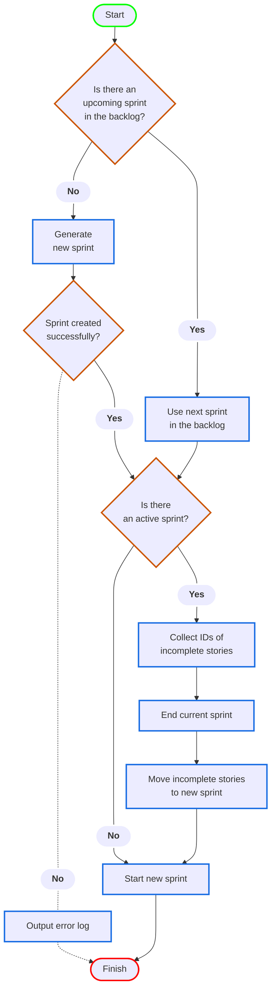

# Description
This is a Python script that can be used to automate JIRA tasks in the sprint-planning process for scrum teams.

 
 

# Table of Contents

[Technologies Used](#technologies-used)  
[Design Diagram](#design-diagram)  
[FAQ](#faq)  
[License](#license)  
[Support](#support)  

 
 

# Technologies Used

<b>Python v3.7</b> - Core language used in the automation script.

<b>Python Libraries:</b>  

`requests` - Used for making HTTP requests to interact with the JIRA API.  
`base64` - Used for encoding JIRA credentials into a base64 string for authentication.  
`os` - Used to access environment variables securely, such as API tokens and email addresses.  
`datetime` & `timedelta` - Used to manage date and time calculations for sprint start and end periods.  
`logging` - Used to handle output and logging throughout the script.  
`certifi` - Used to handle SSL certificate verification and ensure HTTPS connections are secure.

<b>JIRA Agile REST API</b> - Contains the endpoints that the script interacts with.

<b>Mermaid</b> - Used in the README markdown file to document and visualize the logical workflow of the script.  

 
 

# Design Diagram

 
 

# FAQ

&nbsp; How is the new sprint named? &nbsp;
 

> The new sprint will be generated using the definition of the `sprint_name` variable.

 

&nbsp; How are unfinished issues tracked from one sprint to the next? &nbsp;
 

> Because sprints are closed before a transfer occurs, any unfinished stories will display as 'Issues Not Completed' in the sprint
> status report. 

 

&nbsp; How is the automation schedule being set for this script? &nbsp;
 

> The script runs automatically based off the `cron` expression in the sprint_automation yaml file located in the .github folder.  
>   
> More information on cron expressions can be found [here](https://cloud.google.com/scheduler/docs/configuring/cron-job-schedules).  
> 
> The current configuration runs on a bi-weekly schedule based on the initial run date, aligning with the typical 2-week sprint period.

 
 

# License

This project, including the Python script and accompanying documentation, is licensed under the MIT license. See the [LICENSE](LICENSE)
file for details.

 
 

# Support

For any questions or assistance, please reach out to the project creator. 
